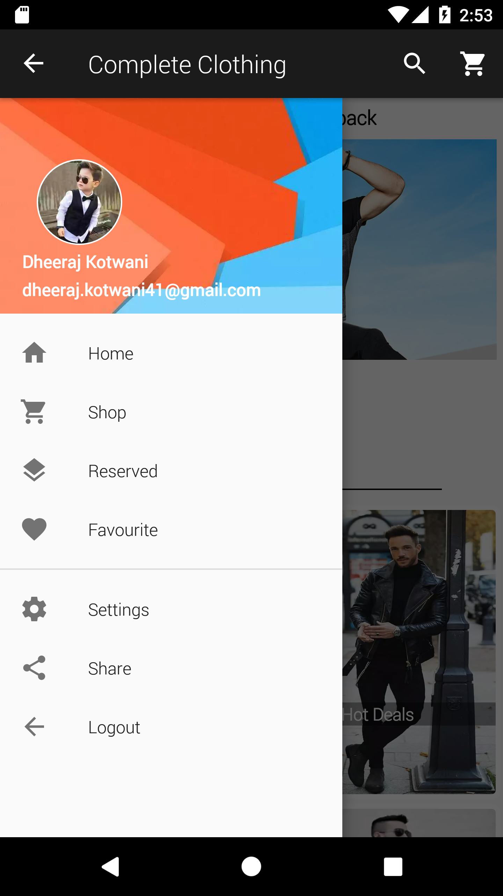
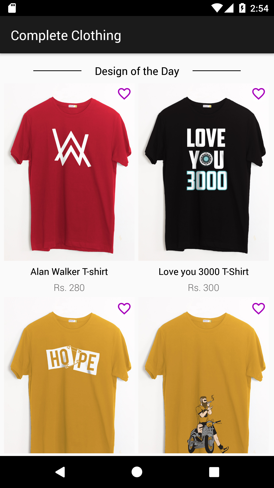
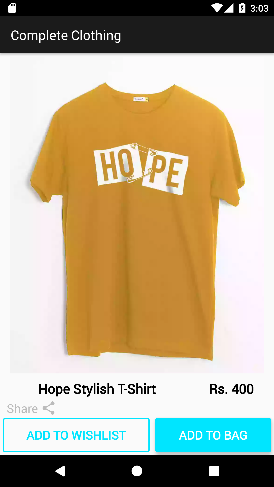
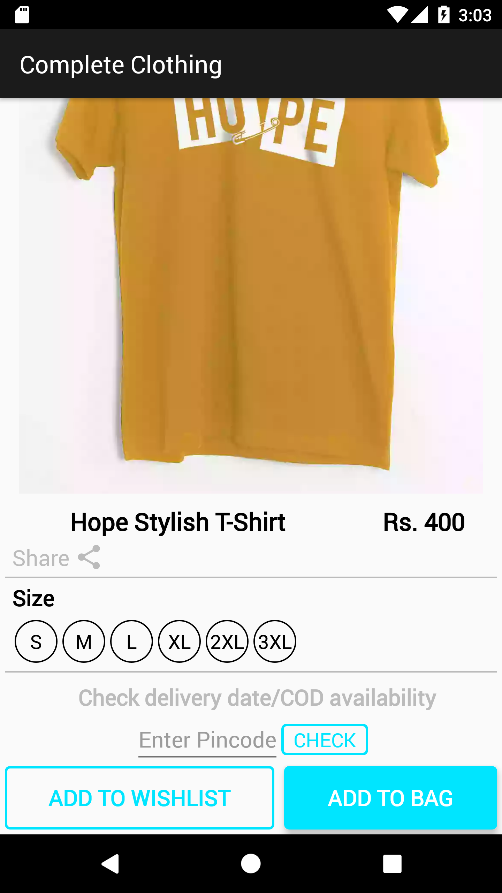
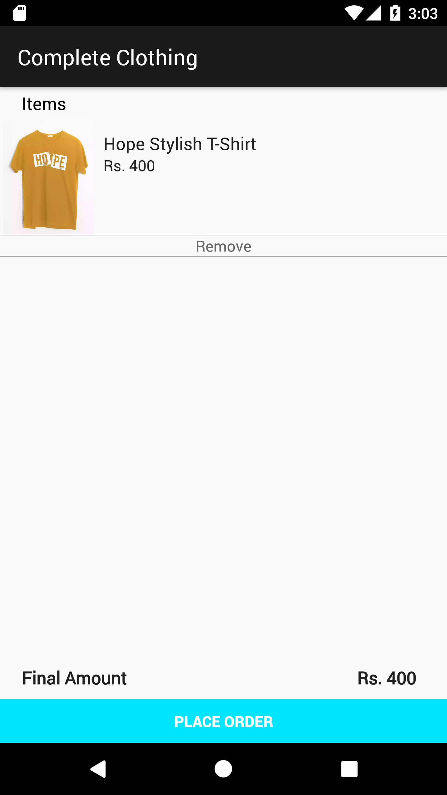

# CompleteClothing
This is a Clothes Shopping app developed for Android Devices. I started this project for practice purpose and will add many more features in it like Database, Networking, Fragments, etc.

## Getting Started

### Requirements
* Android version 5.0 and above

### Screenshots
&nbsp;&nbsp;&nbsp;&nbsp;
&nbsp;&nbsp;&nbsp;&nbsp;
&nbsp;&nbsp;

### Features Integrated
* Recyclerview (LinearLayout and GridLayout)
* Picasso to get images from the internet
* Navigation Drawer
* Cart

### About

* The App is made for practice purpose.
* The App uses recyclerview to smooth the scrolling.
* The App uses Picasso library to get images from the internet.

### Gradle dependencies
#### Implementations
* 'com.squareup.picasso:picasso:2.5.0'
* 'com.google.android.material:material:1.1.0-alpha06'
* 'com.makeramen:roundedimageview:2.3.0'
* 'androidx.recyclerview:recyclerview:1.0.0-beta01'
* 'androidx.cardview:cardview:1.0.0-beta01'
